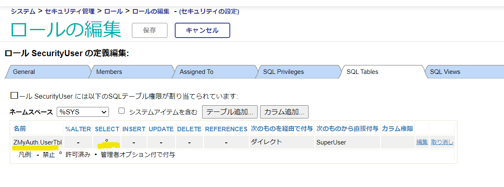
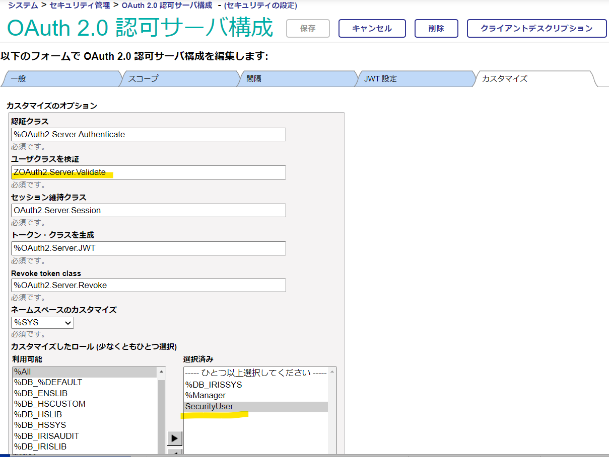

# OAuthサーバのユーザ検証をIRIS内ユーザ以外の情報で検証する例

デフォルトで用意されている **「ユーザクラスを検証」**（ユーザの検証）用ロジックでは、IRIS内ユーザによる検証を行っています。

任意のユーザ情報に対して検証するように変更するためには、%OAuth2.Server.Validateクラスを継承したオリジナルクラスを作成し、ValidateUser()メソッド内のロジックを任意データに対する検証に変更することで対応できます。

なお、%OAuth2.Server.Validateは、%SYS上にあるクラス定義であるため、オリジナルクラスは%SYS上で作成する必要があります。

# 作成までの流れ

## 1. ユーザ情報を格納するテーブルを用意する

例では、%SYSネームスペース上にZで始まるスキーマ名を付けたテーブルを作成し
    
```
create table ZMyAuth.UserTbl(UserID VARCHAR(10),Password VARCHAR(50),Roles VARCHAR(50))
```
    
Rolesには、IRIS内のロールを登録しています（とりあえず %Allにしています）。

```
insert into ZMyAuth.UserTbl (UserID,Password,Roles) VALUES('User1','User1','%All')
```
    
テーブルと2件のユーザ情報を登録するサンプルメソッドを用意しています。
以下実行で、%SYSネームスペースに例のテーブルとユーザ情報が設定されます。

```
zn "%SYS"
do ##class(ZOAuth2.Server.Validate).CreateOriginalUserTable()
```

## 2. 1.で作成したテーブルのSELECT権限を持つロールを作成する

OAuthサーバ上のユーザ検証時、ユーザチェック用に作成したテーブルに対するSELECT権限が必要になるため、SELECT権限のみを持つロールを作成します。

例は、SecurityUserロールを作成し、ZMyAuth.UserTblのSELECT権限を追加しています。




## 3. %SYSネームスペースで%OAuth2.Server.Validateをスーパークラスとしてオリジナルクラスを作成する

Zから始まるパッケージ名で作成すると、アップグレード時にも作成したクラスは残ります


## 4. ValidateUser()メソッドを加工する

スーパークラスのメソッドをオーバーライドします。例は[Validate.cls](ZOAuth2/Server/Validate.cls)をご参照ください。


ValidateUser()メソッドでは、ユーザが入力するユーザ名、パスワードが第1引数、第2引数に渡ってきます。

引数で渡された情報をもとに、**1.で作成したテーブル** を使用して存在チェックを行い、IRIS内のロールを返すような処理を記述しています。

## 5. OAuthサーバの[カスタマイズ]タブを変更する

**ユーザクラスを検証** のクラスを **3** で作成したクラス名（ZOAuth2.Server.Validate）に変更します。

また **カスタマイズしたロール** に、**2.** で作成したロール **SecurityUser** を選択済みに設定します。



以上です
